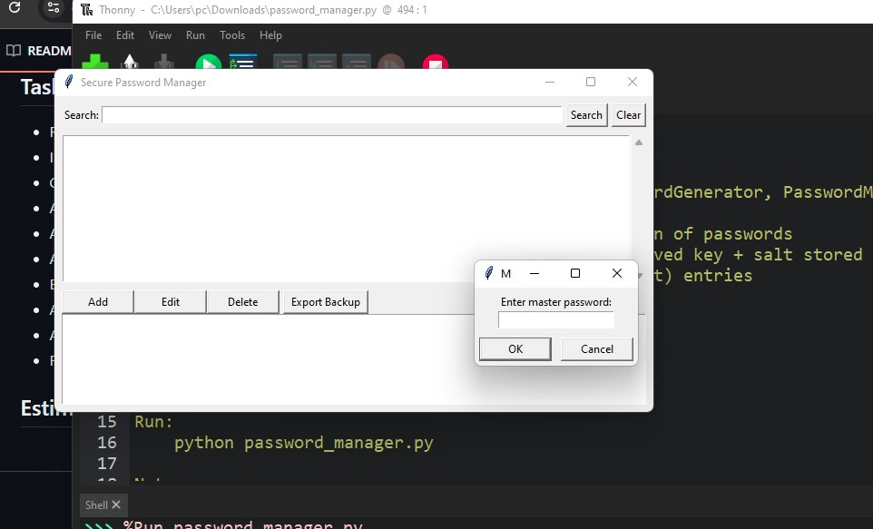
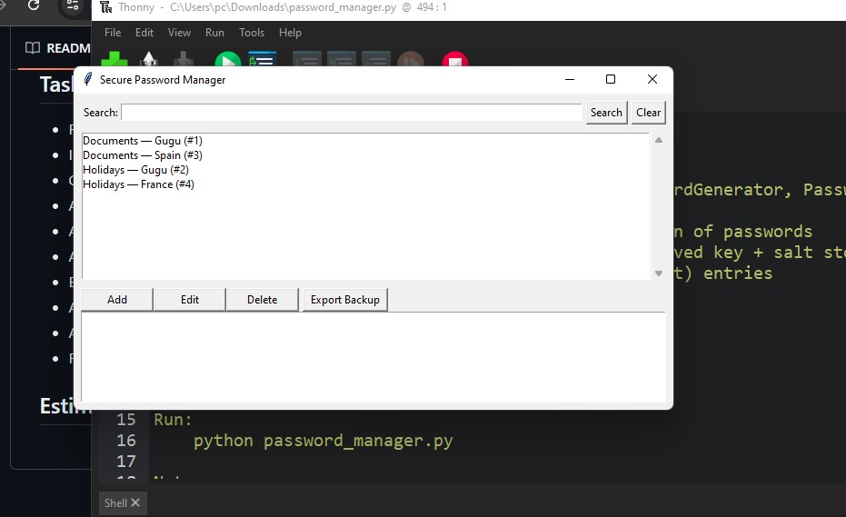
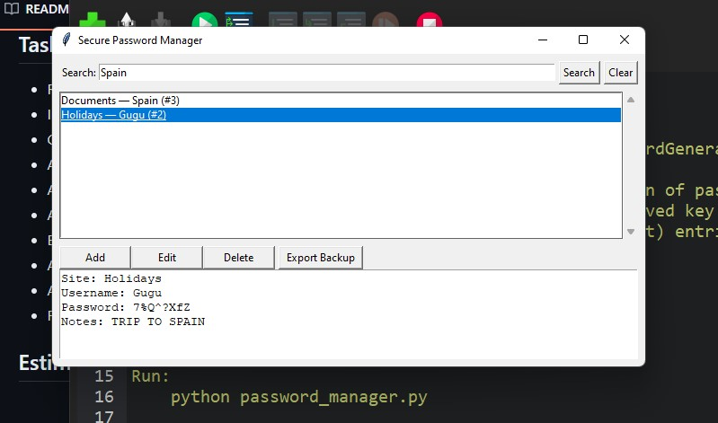
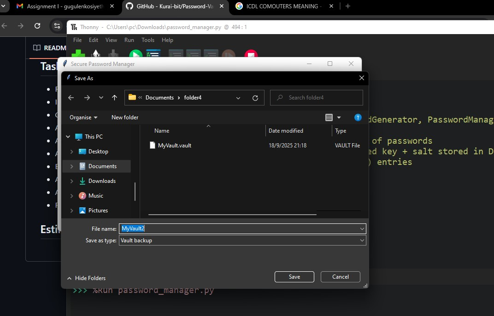
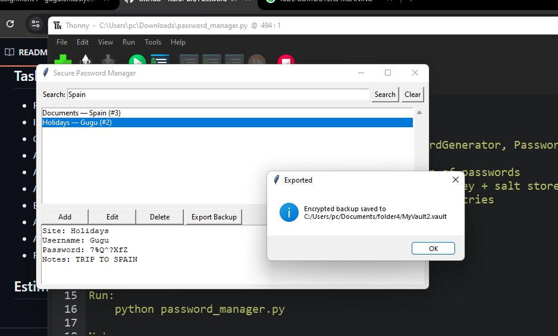
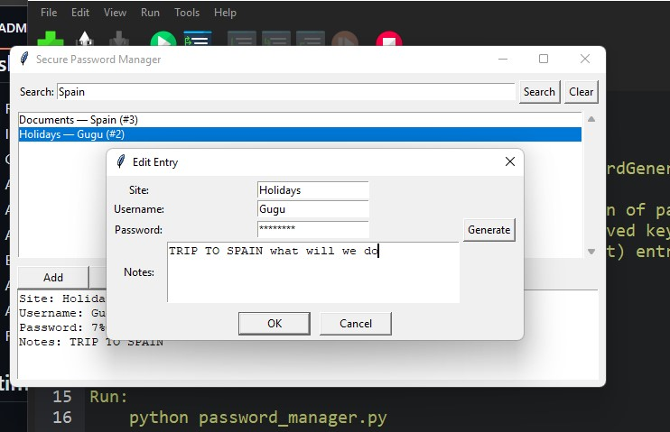
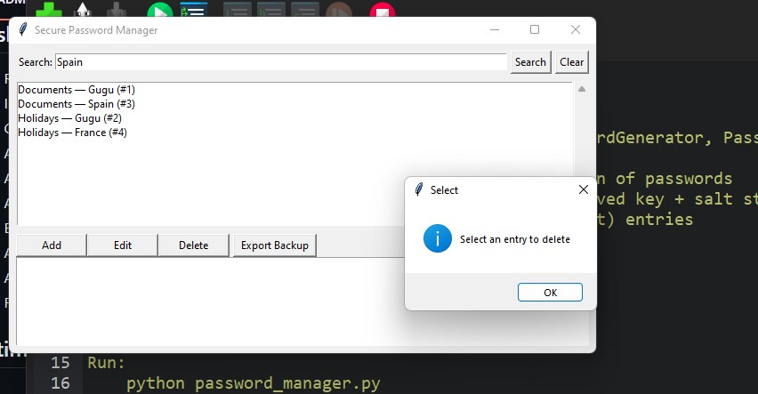
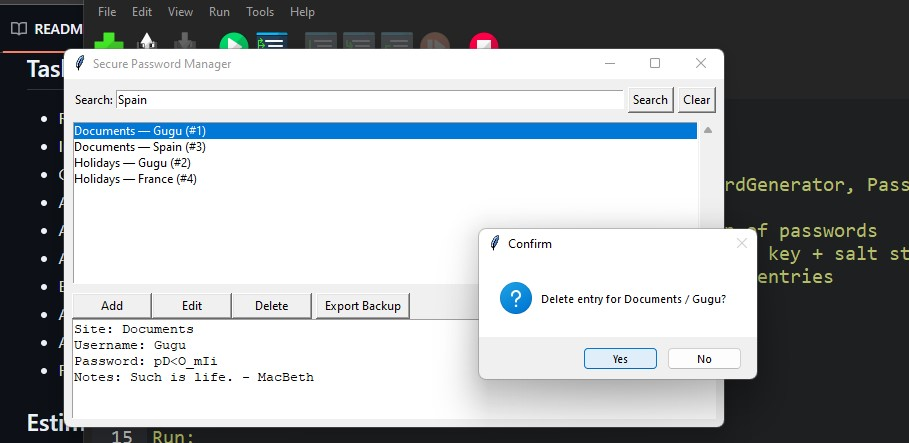

# EUTechFourthProject
Password Vault

- **OOP design** with clear separation of responsibilities:
  - `CryptoManager` – handles encryption/decryption with PBKDF2HMAC + Fernet
  - `DatabaseManager` – manages SQLite database (`vault.db`)
  - `PasswordGenerator` – creates strong random passwords
  - `PasswordManagerGUI` – Tkinter-based graphical interface
- Secure storage:
  - All entries encrypted with your master password
  - Salted key derivation (`PBKDF2HMAC`)
- CRUD operations:
  - Add / Edit / Delete / Search / List / View (decrypt) entries
- Password generator
- Encrypted export/backup (`.vault` file)

bash
pip install cryptography
python PasswordVault.py

On the first run:
You’ll be prompted to set a master password
A vault.db database file will be created in the same folder

Backup & Restore

Export your vault to an encrypted .vault file via the GUI
Keep backups safe — they are still encrypted with your master password

Main application window

Adding/editing an entry

Export/backup dialog

Password generator dialog

Viewing decrypted entry details

If you forget your master password, data cannot be recovered

